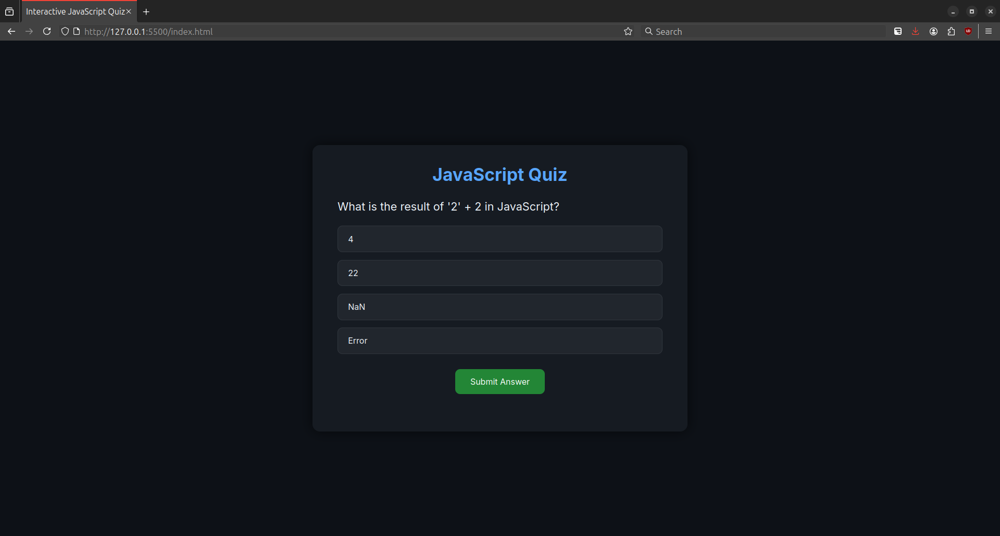
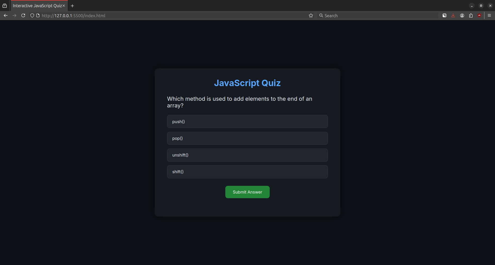

## 🏢 Internship Details

- **Company:** CODTECH IT Solutions  

- **Name:** K s s chandra mouli

- **Intern ID:** :CT04DY502

- **Domain:** Front-End Development  

- **Duration:** 4 Weeks

- **Mentor:** Neela Santhosh

# 💡 Interactive JavaScript Quiz App

MENTOR: NEELA SANTOSH
A sleek and responsive **quiz web application** built using **HTML**, **CSS**, and **Vanilla JavaScript**. This project challenges users with multiple-choice JavaScript questions, tracks scores, and displays a detailed review of incorrect answers — all in a beautifully themed dark UI.

---

## 🌐 Live Demo

> 🚀 [Coming Soon or Add your Netlify/GitHub Pages Link here]

---

## 🧠 What I Learned

This project was a fun and insightful exercise where I:

- ✅ Practiced **DOM manipulation** and event handling in JavaScript
- ✅ Designed a **clean, modern dark UI** using only **CSS**
- ✅ Built logic for:
  - Dynamically loading questions
  - Managing answer selection
  - Tracking scores and displaying results
- ✅ Understood how to **structure code** across HTML, CSS, and JS for maintainability
- ✅ Learned how to create **user-friendly interfaces** with hover effects, visual feedback, and animations

---

## 🛠️ Tech Stack

| Technology     | Purpose                           |
|----------------|-----------------------------------|
| **HTML5**      | Structure of the app              |
| **CSS3**       | Styling and responsive design     |
| **JavaScript** | App logic and interactivity       |
| **Google Fonts** | Custom font for elegant UI     |
| **VS Code + Live Server** | Local development & testing |

---

## ✨ Features

- 🎯 Interactive and dynamic quiz system
- 🌑 Sleek **dark mode** theme for better UX
- 📈 Score tracking with percentage output
- ✅ Color-coded answers (correct vs wrong)
- 📝 **Review section** showing wrong answers with corrections
- 💻 Fully **responsive design**
- ⚡ Smooth UI animations
- 🔄 Restart-friendly logic (easy to extend)

---

## 🧪 How To Use

1. 📥 Clone or download the repository
2. 📂 Open the folder in [Visual Studio Code](https://code.visualstudio.com/)
3. 🖱️ Right-click on `index.html` and choose **“Open with Live Server”**
4. 🧠 Take the quiz and see your results instantly!

---

## 🛣️ Roadmap / Future Enhancements

Here are a few features I'd like to add going forward:

- [ ] 🎮 Add a **start screen** with a "Start Quiz" button
- [ ] ⏱ Add **per-question timer**
- [ ] 🔁 Enable **quiz restart** with a "Try Again" button
- [ ] 🔀 Shuffle questions and choices for randomness
- [ ] 🌗 Toggle between **dark and light mode**
- [ ] 💾 Save high scores using `localStorage`
- [ ] 📱 Enhance mobile experience further with fluid layout

---

## 📌 Key Code Concepts Used

- DOM traversal and manipulation
- `addEventListener` for interaction handling
- Dynamic element creation (`document.createElement`)
- Array mapping and looping
- `innerHTML` updates for result rendering
- CSS flexbox and transitions
- Responsive design with media queries (optional)

---

## 📷 Screenshots

## 📸 Screenshot

